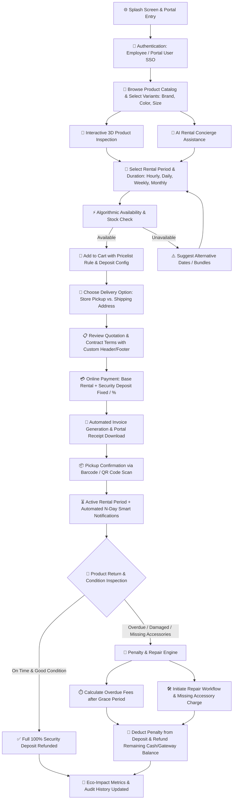
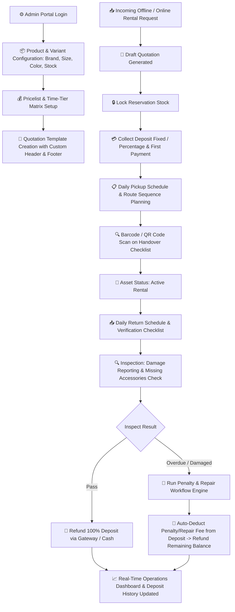
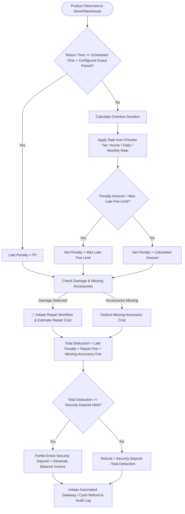

# 🏗️ Odoo Rental Management System: Technical Architecture & Flowcharts

---

## 🎯 Selected Industry Niche: Enterprise Tech & Hardware Rental (*OmniRent Pro*)
To maximize evaluator impact and showcase realistic high-value transactions (where security deposits, insurance, variant pricing, and technical specifications matter), **OmniRent Pro** targets **High-Performance Tech & Enterprise Hardware**:
- **Products**: NVIDIA H100/A100 AI Compute Rigs, RED Cinema 8K Cameras, Event Workstations, VR/AR Headsets, Drone Fleets.
- **Why it wins**: High rental value makes security deposits critical, 3D renders of hardware look stunning, and AI assistance is extremely natural when helping users pick complex hardware setups.

---

## 📊 Core System Flowcharts

### 1. End-to-End Customer Rental Journey


---

### 2. Admin Operational & Warehouse Lifecycle


---

### 3. Algorithmic Overlap & Availability Logic
```mermaid
flowchart TD
    Start([User Requests Product P, Quantity Q, Start Time S, End Time E]) --> Buffer[Add Maintenance/Turnaround Buffer: S_buff = S - T_buffer, E_buff = E + T_buffer]
    Buffer --> Fetch[Query Active Orders where Status in 'CONFIRMED', 'PICKED_UP']
    Fetch --> OverlapCheck[Find Overlapping Bookings: Existing_S < E_buff AND Existing_E > S_buff]
    OverlapCheck --> SumBooked[Calculate Max Concurrently Rented Stock during [S, E]]
    
    SumBooked --> CheckCap{Total_Stock - Max_Booked >= Q?}
    CheckCap -- Yes --> Approve[✅ Lock Temp Hold & Return Available]
    CheckCap -- No --> Reject[❌ Return Unavailable + Nearest Available Time Slots]
```

---

### 4. Security Deposit & Penalty Settlement Engine (with Grace Period & Repair Flow)


---

## 🛠️ Complete Technical Stack Recommendation

| Component | Framework / Technology | Purpose |
| :--- | :--- | :--- |
| **Backend API** | **Django 5.0 / FastAPI** | Relational integrity, ACID transactions, complex interval queries, admin panel |
| **Database** | **PostgreSQL + PostGIS** | Time-range index (`TSTZRANGE`), JSONB attributes, pickup location spatial queries |
| **Frontend App** | **Vite + React 18 + TypeScript** | Lightning fast SPA, modular customer portal, real-time inventory calendar |
| **Styling & UI** | **Tailwind CSS + Lucide Icons + Shadcn UI** | High-end dark/light theme, modern glassmorphism, responsive grid |
| **3D Rendering** | **Three.js / React Three Fiber (`@react-three/fiber`)** | Interactive 3D product previews and digital twin inspection |
| **AI Agent** | **Google GenAI SDK (Gemini 3.6 / Flash)** | Natural language hardware bundling, contract queries, availability advice |
| **Payments** | **Razorpay / Stripe Webhooks** | Automated pre-authorization, deposit holding, and partial refund API calls |
| **Task Queue** | **Celery + Redis** | Automated return reminders ('N' days before), late fee trigger cron jobs |

---

## 🧮 Comprehensive Database Schema (Entity Relationship Outline)

```sql
-- 1. Product & Variants Table
CREATE TABLE products (
    id UUID PRIMARY KEY,
    name VARCHAR(255) NOT NULL,
    brand VARCHAR(100),
    manufacturer VARCHAR(100),
    color VARCHAR(50),
    size VARCHAR(50),
    total_stock INT NOT NULL,
    base_price_per_hour NUMERIC(10, 2),
    base_price_per_day NUMERIC(10, 2),
    base_price_per_week NUMERIC(10, 2),
    base_price_per_month NUMERIC(10, 2),
    deposit_type VARCHAR(20) DEFAULT 'FIXED', -- 'FIXED' or 'PERCENTAGE'
    security_deposit_amount NUMERIC(10, 2), -- Fixed amount or percentage e.g. 20.00%
    grace_period_minutes INT DEFAULT 30,
    max_late_fee_limit NUMERIC(10, 2),
    model_3d_url VARCHAR(512),
    co2_savings_kg NUMERIC(6, 2)
);

-- 2. Pricelist Matrix
CREATE TABLE pricelists (
    id UUID PRIMARY KEY,
    name VARCHAR(100) NOT NULL, -- e.g., 'Corporate VIP', 'Weekend Special'
    customer_tier VARCHAR(50),
    discount_percentage NUMERIC(5, 2),
    valid_from TIMESTAMPTZ,
    valid_until TIMESTAMPTZ
);

-- 3. Quotation Templates
CREATE TABLE quotation_templates (
    id UUID PRIMARY KEY,
    name VARCHAR(100) NOT NULL,
    header_text TEXT,
    footer_text TEXT,
    default_payment_terms TEXT
);

-- 4. Rental Order & Contract
CREATE TABLE rental_orders (
    id UUID PRIMARY KEY,
    customer_id UUID REFERENCES users(id),
    status VARCHAR(50), -- DRAFT, QUOTATION, CONFIRMED, PICKED_UP, RETURNED, OVERDUE, REPAIR
    delivery_type VARCHAR(50), -- 'STORE_PICKUP' or 'SHIPPING'
    pickup_route_sequence INT,
    start_time TIMESTAMPTZ NOT NULL,
    end_time TIMESTAMPTZ NOT NULL,
    actual_return_time TIMESTAMPTZ,
    total_rental_fee NUMERIC(10, 2),
    security_deposit_held NUMERIC(10, 2),
    late_penalty_deducted NUMERIC(10, 2) DEFAULT 0,
    repair_fee_deducted NUMERIC(10, 2) DEFAULT 0,
    deposit_refunded NUMERIC(10, 2) DEFAULT 0,
    qr_code_hash VARCHAR(256)
);

-- 5. Repair Workflows
CREATE TABLE repair_workflows (
    id UUID PRIMARY KEY,
    order_id UUID REFERENCES rental_orders(id),
    product_id UUID REFERENCES products(id),
    issue_description TEXT,
    missing_accessories TEXT,
    estimated_cost NUMERIC(10, 2),
    status VARCHAR(50) -- 'INSPECTION_PENDING', 'IN_REPAIR', 'RESOLVED'
);

-- 6. Overlap Index Range Constraint (PostgreSQL TSTZRANGE)
CREATE EXTENSION btree_gist;
ALTER TABLE rental_order_items ADD CONSTRAINT no_overbooking 
EXCLUDE USING gist (product_id WITH =, TSTZRANGE(start_time, end_time) WITH &&);
```
