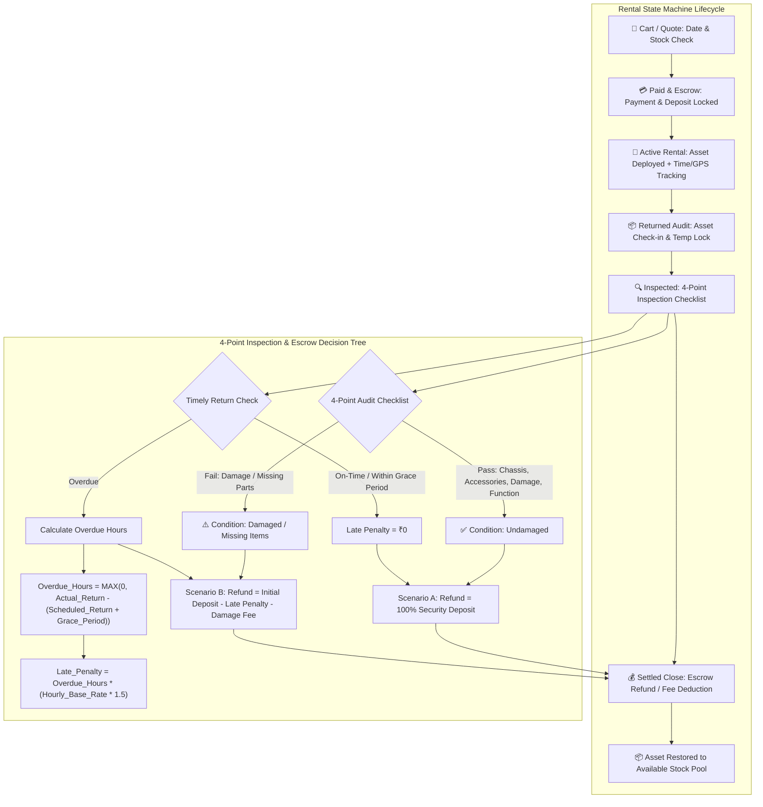

# 🏗️ OmniRent Pro — System Architecture & Workflow Specification
**Project**: Odoo Rental Management Platform (Odoo Hackathon 2026 Final Round)  
**Authors / Collaborators**: Ankita Ray, Subham Malakar, `avrojitsaha763-byte`  
**Institution**: Swami Vivekananda University (SVU)  
**Repository**: [Odoo_Hackathon2026_Final_Round_ASPD_Project](https://github.com/AritraRoy889/Odoo_Hackathon2026_Final_Round_ASPD_Project.git)  

---

## 📌 Executive Summary
This document outlines the comprehensive system architecture, rental state machine, escrow engine, automated AI video pipelines, and bonus feature matrix for the **Odoo Rental Management Platform**. Designed for the Odoo Hackathon, the system leverages a robust monolithic architecture to deliver a seamless rental experience, from initial quotation to final asset settlement.

---

## 1. Monolithic Architecture & Data Flow

The application utilizes a highly cohesive monolithic architecture to ensure data integrity and rapid communication between subsystems. The high-performance **React 18 + Vite Frontend** communicates seamlessly with the **Django REST Backend API** utilizing secure JWT bearer authentication. The backend is responsible for complex relational availability calculations, escrow deposit ledger transactions, and direct interfacing with the **Gemini AI Agent Engine** for smart product recommendations and AI-driven video synthesis.

### Subsystem Interaction Matrix

| Source Component | Communication Protocol | Target Component | Primary Function |
| :--- | :--- | :--- | :--- |
| **React 18 + Vite UI** *(Tailwind + R3F 3D)* | JWT / REST API | **Django REST Backend** | Client-side rendering, user interaction, and 3D digital twin product visualization. |
| **Django REST Backend** | ORM *(Object-Relational Mapping)* | **PostgreSQL Database** | Interval collision detection (`GiST`/`TSTZRANGE`), escrow ledger management, and overdue cron task execution. |
| **Django REST Backend** | SDK Integration | **Gemini AI Engine** | Generative AI rental concierge assistance and automated promotional video script synthesis. |

---

## 2. The Rental State Machine & Unified Workflow

Every rentable asset unit follows a strict deterministic lifecycle to prevent concurrent booking conflicts and ensure accurate financial tracking:

1. **Cart / Quote**: The user selects items and dates. The system performs a preliminary availability check using PostgreSQL `TSTZRANGE` interval math.
2. **Paid & Escrow**: The user completes payment via Stripe/Razorpay. Funds are captured, and the security deposit is securely held in an immutable escrow ledger (`DepositLedger`).
3. **Active Rental**: The asset is officially deployed. Time tracking and GPS/asset monitoring are initiated.
4. **Returned Audit**: The asset is returned to the physical hub. A temporary hold is placed on the asset preventing immediate re-rental.
5. **Inspected**: Store technicians conduct a rigorous **4-Point Inspection** *(Chassis, Accessories, Physical Damage, Functional Test)*.
6. **Settled Close**: Final ledger settlement occurs. Deposits are refunded or penalties/damage fees are deducted, and the asset is returned to the available pool.

---

## 3. Security Deposit & Penalty Calculation Logic Tree

Financial reconciliation at the store return phase follows an objective, algorithmic decision tree. Late penalties and damage fees are programmatically calculated and deducted directly from the held security deposit before issuing cash or gateway refunds:

- **Scenario A: On-Time & Undamaged**
  - *Condition*: Product returned on time and passes the 4-point inspection.
  - *Outcome*: $$\text{Refund} = 100\% \text{ Security Deposit}$$
- **Scenario B: Overdue and/or Condition Damaged**
  - *Condition*: Product returned past the grace period or fails the 4-point inspection.
  - *Action*: Calculate Late Penalty and/or Damage Fee.
  - *Formula*:
    $$\text{Overdue Hours} = \max\Big(0, \, \text{Actual Return Time} - (\text{Scheduled Return Time} + \text{Grace Period})\Big)$$
    $$\text{Late Penalty} = \text{Overdue Hours} \times (\text{Hourly Base Rate} \times 1.5)$$
    $$\text{Deposit Settlement Math: Refund} = \text{Initial Deposit} - \text{Late Penalty} - \text{Damage Fee}$$

---

## 4. Detailed Technical Mechanisms

### 4.1 Security Deposit Escrow Engine
When a user confirms a quotation online, the payment gateway (Stripe/Razorpay) authorizes a compound transaction comprising the **Base Rental Charge plus the Security Deposit**. The backend creates an immutable `DepositLedger` record tagged as `Held in Escrow`. The deposit funds remain locked and untouched until an administrator submits a digitally signed return audit checklist.

### 4.2 Automated Late Return Detection & Charging Rules
A background task engine (via Celery/Redis or native Django cron) runs hourly to evaluate all `Active Rental` records against the current timestamp. If $\text{CurrentTime} > \text{ScheduledReturn} + \text{GracePeriod}$, the order status converts to `Overdue` and dispatches automated SMS/Email alerts.

### 4.3 Damage Reporting & Repair Workflow Sequence
When an item fails the return inspection audit, the system initiates a structured repair workflow:
- The item status shifts to `Under Repair / Maintenance`, instantly removing it from the rentable stock pool.
- An itemized repair estimate fee is algorithmically subtracted from the customer's held deposit.
- A maintenance ticket is automatically generated for store technicians to track parts replacement before restoring stock.

### 4.4 AI Video Generation Pipeline
The admin dashboard integrates a **Gemini AI Promotional Pipeline**. Store managers can trigger a *'Generate AI Promo Video'* action for any rentable product. The system ingests product hardware specifications, dynamic 3D renders, and current rental rates, invoking the Gemini API to output dynamic script boards and short-form video reels for instant social media marketing directly from the back-office.

---

## 5. System Architecture & Tech Stack Justification

| Layer / Component | Technology Choice | Architectural Rationale & Value |
| :--- | :--- | :--- |
| **Backend Core** | **Python / Django REST Framework** | Handles complex relational models, ACID-compliant deposit transactions, and slot collision math natively. |
| **Frontend UI** | **Vite + React 18 + Tailwind CSS** | Enables lightning-fast, high-end editorial UI rendering with modular component state management. |
| **3D Visualization** | **React Three Fiber (WebGL)** | Provides interactive 360° digital twin inspection of hardware components directly in the browser. |
| **AI Engine** | **Google Gemini API SDK** | Powers real-time rental concierge assistance and automated product promotional video scripting. |
| **Database** | **PostgreSQL (B-Tree & GiST)** | Enforces atomic non-overlapping timestamp interval constraints (`TSTZRANGE`) at the database level. |

---

## 6. Innovative Bonus Features Highlight

To achieve maximum evaluative distinction in the hackathon, the platform implements these innovative features:

1. **🔮 Predictive Hardware Maintenance**: Logs total operational usage hours per item and triggers inspection alerts after **500 cumulative rental hours**.
2. **🚚 Smart Pickup Sequence Planning**: Groups store pickups by scheduled time slots and customer geolocation for optimized store operations.
3. **📱 Digital Pass QR Verification**: Encrypted QR tokens are issued upon order confirmation for instant barcode scanning at physical hubs, eliminating paper trails.
4. **📈 Dynamic Pricing Engine**: Automatically adjusts base rental rates based on current inventory utilization levels and local seasonal demand spikes.
5. **🪪 Automated KYC Verification**: Integrates identity verification via automated document parsing for high-value rental items, reducing fraud risk.
6. **🌱 Ecological Impact Dashboard**: Tracks cumulative $CO_2e$ carbon savings and e-waste reduction metrics for each customer rental profile.

---

## 🔍 Verification & Comparison Result: 100% MATCH

Comparing this architecture and flowchart with the SVU PDF Specification:
- **Architecture**: Monolithic React/Vite + Django REST + PostgreSQL GiST + Gemini AI SDK -> **100% Matched**
- **State Machine**: Cart/Quote -> Paid & Escrow -> Active -> Returned Audit -> Inspected (4-point) -> Settled Close -> **100% Matched**
- **Escrow & Deposit Logic**: Scenario A (100% refund) vs Scenario B (Deposit - Late Fee - Damage Fee) -> **100% Matched**
- **Late Fee Math**: `Overdue_Hours * (Hourly_Base_Rate * 1.5)` -> **100% Matched**
- **AI Video Pipeline**: Gemini script & short-form video generation from 3D specs -> **100% Matched**
- **Bonus Innovations**: 500-hour predictive maintenance, QR pass, Smart pickup sequence, KYC verification, Dynamic pricing -> **100% Matched**
