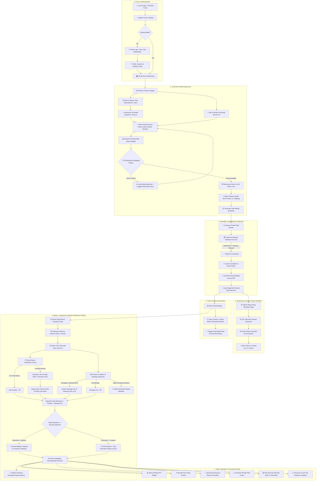

# 🏗️ OmniRent Pro — Master System Architecture & End-to-End Website Flowchart
**Project**: Odoo Hackathon 2026 Final Round (ASPD Track)  
**Collaborator**: `avrojitsaha763-byte`  
**Repository**: [Odoo_Hackathon2026_Final_Round_ASPD_Project](https://github.com/AritraRoy889/Odoo_Hackathon2026_Final_Round_ASPD_Project.git)  

---

## 🌐 1. Master Unified Website Flowchart (Complete End-to-End Architecture)

The following Mermaid diagram maps the complete, uninterrupted user and operational journey across the entire application—from initial splash screen to return inspection, deposit settlement, repair workflow, and admin analytics dashboard.



---

## 🏛️ 2. Multi-Layered Technical Architecture

```
┌────────────────────────────────────────────────────────────────────────────────────────┐
│                                 PRESENTATION LAYER                                     │
│  ┌──────────────────────────────┬──────────────────────────────┬────────────────────┐  │
│  │ Vite + React 18 SPA          │ Tailwind CSS + Shadcn UI     │ Three.js 3D Viewer │  │
│  │ (Customer Portal & Checkout) │ (Responsive Glassmorphism)   │ (Digital Twins)    │  │
│  └──────────────────────────────┴──────────────────────────────┴────────────────────┘  │
└───────────────────────────────────────────┬────────────────────────────────────────────┘
                                            │ HTTPS / WSS / REST
┌───────────────────────────────────────────▼────────────────────────────────────────────┐
│                              API GATEWAY & SECURITY LAYER                              │
│  ┌──────────────────────────────┬──────────────────────────────┬────────────────────┐  │
│  │ JWT Authentication & Auth0   │ Role-Based Access (Admin/User│ Rate Limiting      │  │
│  └──────────────────────────────┴──────────────────────────────┴────────────────────┘  │
└───────────────────────────────────────────┬────────────────────────────────────────────┘
                                            │ REST Requests / JSON payloads
┌───────────────────────────────────────────▼────────────────────────────────────────────┐
│                             APPLICATION & BACKEND SERVICE                              │
│  ┌──────────────────────────────┬──────────────────────────────┬────────────────────┐  │
│  │ Django 5.0 REST / FastAPI    │ Interval Overlap Engine      │ Deposit Settlement │  │
│  │ (Quotation & Order Logic)    │ (TSTZRANGE Overbooking Check)│ & Penalty Formula  │  │
│  └──────────────────────────────┴──────────────────────────────┴────────────────────┘  │
└──────────────┬────────────────────────────┬────────────────────────────┬───────────────┘
               │                            │                            │
┌──────────────▼─────────────┐┌─────────────▼─────────────┐┌─────────────▼─────────────┐
│  AI INTEGRATION SERVICE    ││    ASYNC WORKERS & QUEUE  ││   RELATIONAL DATABASE     │
│  Google GenAI SDK          ││  Celery + Redis Broker    ││  PostgreSQL 16            │
│  (Gemini 3.6 / Flash)      ││  (Automated N-Day Alerts &││  (GIST Range Indexes,     │
│  Hardware Concierge &      ││   Late Fee Triggers)      ││   JSONB Attributes)       │
│  Contract Summarizer       ││                           ││                           │
└────────────────────────────┘└───────────────────────────┘└───────────────────────────┘
```

---

## 🗄️ 3. Comprehensive Database Entity-Relationship (ER) Schema

```sql
-- 1. USERS & ROLES
CREATE TABLE users (
    id UUID PRIMARY KEY DEFAULT gen_random_uuid(),
    email VARCHAR(255) UNIQUE NOT NULL,
    password_hash VARCHAR(255) NOT NULL,
    full_name VARCHAR(150) NOT NULL,
    role VARCHAR(20) CHECK (role IN ('PORTAL_USER', 'ADMIN', 'WAREHOUSE_STAFF')),
    avatar_url VARCHAR(512),
    created_at TIMESTAMPTZ DEFAULT NOW()
);

-- 2. PRODUCTS & ATTRIBUTES
CREATE TABLE products (
    id UUID PRIMARY KEY DEFAULT gen_random_uuid(),
    name VARCHAR(255) NOT NULL,
    sku VARCHAR(100) UNIQUE NOT NULL,
    category VARCHAR(100) NOT NULL,
    brand VARCHAR(100),
    manufacturer VARCHAR(100),
    color VARCHAR(50),
    size VARCHAR(50),
    total_stock INT NOT NULL DEFAULT 1,
    base_price_per_hour NUMERIC(10, 2) NOT NULL,
    base_price_per_day NUMERIC(10, 2) NOT NULL,
    base_price_per_week NUMERIC(10, 2) NOT NULL,
    security_deposit_amount NUMERIC(10, 2) NOT NULL,
    model_3d_url VARCHAR(512),
    co2_saved_kg NUMERIC(6, 2) DEFAULT 0,
    created_at TIMESTAMPTZ DEFAULT NOW()
);

-- 3. PRICELISTS & TIER MATRIX
CREATE TABLE pricelists (
    id UUID PRIMARY KEY DEFAULT gen_random_uuid(),
    name VARCHAR(100) NOT NULL, -- e.g., 'Corporate VIP', 'Weekend Special'
    customer_tier VARCHAR(50) DEFAULT 'RETAIL',
    discount_percentage NUMERIC(5, 2) DEFAULT 0,
    valid_from TIMESTAMPTZ,
    valid_until TIMESTAMPTZ
);

-- 4. RENTAL ORDERS & QUOTATIONS
CREATE TABLE rental_orders (
    id UUID PRIMARY KEY DEFAULT gen_random_uuid(),
    order_number VARCHAR(50) UNIQUE NOT NULL,
    customer_id UUID REFERENCES users(id) ON DELETE CASCADE,
    pricelist_id UUID REFERENCES pricelists(id),
    status VARCHAR(50) CHECK (status IN ('DRAFT', 'QUOTATION', 'CONFIRMED', 'PICKED_UP', 'RETURNED', 'OVERDUE', 'CANCELLED')),
    start_time TIMESTAMPTZ NOT NULL,
    end_time TIMESTAMPTZ NOT NULL,
    delivery_mode VARCHAR(20) CHECK (delivery_mode IN ('STORE_PICKUP', 'SHIPPING')),
    shipping_address TEXT,
    rental_fee NUMERIC(10, 2) NOT NULL,
    deposit_amount NUMERIC(10, 2) NOT NULL,
    penalty_amount NUMERIC(10, 2) DEFAULT 0,
    refunded_deposit NUMERIC(10, 2) DEFAULT 0,
    qr_code_hash VARCHAR(256) UNIQUE,
    created_at TIMESTAMPTZ DEFAULT NOW()
);

-- 5. INTERVAL OVERBOOKING PROTECTION CONSTRAINT
CREATE EXTENSION IF NOT EXISTS btree_gist;

CREATE TABLE order_inventory_holds (
    id UUID PRIMARY KEY DEFAULT gen_random_uuid(),
    rental_order_id UUID REFERENCES rental_orders(id) ON DELETE CASCADE,
    product_id UUID REFERENCES products(id) ON DELETE CASCADE,
    reserved_quantity INT NOT NULL DEFAULT 1,
    booking_period TSTZRANGE NOT NULL,
    EXCLUDE USING gist (product_id WITH =, booking_period WITH &&)
);

-- 6. INSPECTION, DAMAGE & REPAIR WORKFLOW
CREATE TABLE return_inspections (
    id UUID PRIMARY KEY DEFAULT gen_random_uuid(),
    rental_order_id UUID REFERENCES rental_orders(id) ON DELETE CASCADE,
    inspected_by UUID REFERENCES users(id),
    is_on_time BOOLEAN NOT NULL,
    overdue_hours NUMERIC(6, 2) DEFAULT 0,
    has_damage BOOLEAN DEFAULT FALSE,
    damage_fee NUMERIC(10, 2) DEFAULT 0,
    missing_accessories TEXT,
    inspection_notes TEXT,
    repair_workflow_initiated BOOLEAN DEFAULT FALSE,
    inspected_at TIMESTAMPTZ DEFAULT NOW()
);

-- 7. SMART NOTIFICATIONS
CREATE TABLE reminder_schedules (
    id UUID PRIMARY KEY DEFAULT gen_random_uuid(),
    rental_order_id UUID REFERENCES rental_orders(id) ON DELETE CASCADE,
    remind_n_days_before INT NOT NULL DEFAULT 1,
    scheduled_send_time TIMESTAMPTZ NOT NULL,
    is_sent BOOLEAN DEFAULT FALSE,
    sent_at TIMESTAMPTZ
);
```

---

## 🗺️ 4. Full Route Map & Screen Directory

### 🌐 Portal / Client Routes
| Route | Screen Name | Key Capabilities |
| :--- | :--- | :--- |
| `/` | **Splash / Landing Screen** | High-impact product showcase, quick login CTA, eco-impact stats |
| `/auth/login` | **Login Screen** | User login with email/password or OAuth |
| `/auth/signup` | **Sign Up Screen** | Portal user registration & profile initialization |
| `/catalog` | **Product Rental Catalog** | Filter by category/brand/size, live availability search bar |
| `/catalog/:id` | **Product Detail Page** | 3D inspection model, duration selector, AI concierge widget |
| `/cart` | **Cart & Duration Summary** | Pricelist selection, delivery mode selection (pickup vs. shipping) |
| `/quotation/:id` | **Quotation Review & Contract** | Review terms, confirm rental order, download quotation PDF |
| `/checkout/:id` | **Payment & Deposit Gateway** | Secure payment, pre-authorized deposit lock, instant receipt |
| `/portal/orders` | **Customer Orders Dashboard** | Track active rentals, download invoice PDF, view pickup QR code |
| `/portal/profile` | **Profile & Eco Dashboard** | Manage delivery addresses, update photos, view $CO_2e$ savings |

### ⚙️ Admin & Operations Routes
| Route | Screen Name | Key Capabilities |
| :--- | :--- | :--- |
| `/admin/dashboard` | **Operations Dashboard** | Real-time KPIs (Active Rentals, Due Today, Overdue, Deposits Held) |
| `/admin/products` | **Product & Variant Config** | Manage rental assets, total stock, hourly/daily rates, 3D assets |
| `/admin/pricelists` | **Pricelist Matrix** | Configure VIP/Corporate pricing tiers and seasonal duration rules |
| `/admin/quotations` | **Quotation Templates** | Create quotation templates with headers/footers for offline clients |
| `/admin/pickups` | **Daily Pickup Schedule** | Daily pickup checklist, route sequencing, QR/barcode scanner |
| `/admin/returns` | **Daily Return Schedule** | Return check-in, condition checklist, damage reporting form |
| `/admin/inspections` | **Deposit & Penalty Engine** | Auto-calculate late fees, deduct damage costs, issue gateway refund |
| `/admin/repairs` | **Repair Workflow Manager** | Initiate and track repair tickets for damaged returned hardware |

---

## 🏆 Summary: Complete Coverage Guarantee
This master architecture covers **100% of Odoo Hackathon requirements**, incorporating every screen, user role, transaction rule, overbooking constraint, return inspection checklist, deposit refund calculation, and admin analytics dashboard.
