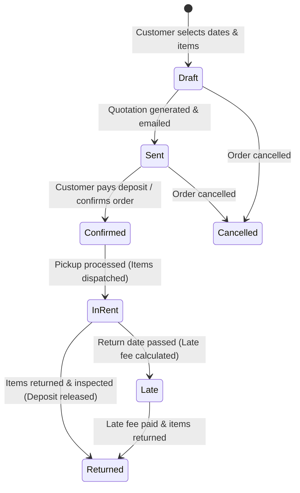

# Odoo Rental Management System - Technical Implementation & Architectural Blueprint

This document details the complete end-to-end technical implementation plan for the **Odoo Rental Management System (Godtier Edition)** based on the Odoo Hackathon 2026 specifications and Excalidraw system design flowcharts.

---

## 1. System Architecture & Module Structure

The project is structured as a custom Odoo module `rental_management_godtier` extending Odoo 17.0/18.0 Community & Enterprise core.

```
rental_management_godtier/
├── __manifest__.py
├── controllers/
│   ├── main.py
│   ├── portal.py
│   └── website_rental.py
├── models/
│   ├── availability_engine.py
│   ├── product_template.py
│   ├── rental_order.py
│   └── rental_order_line.py
├── views/
│   ├── portal_templates.xml
│   ├── rental_order_views.xml
│   └── website_rental_templates.xml
├── security/
│   └── ir.model.access.csv
└── report/
    └── rental_order_report_template.xml
```

---

## 2. Core Business State Machine & Workflow



---

## 3. Real-Time Stock Availability Algorithm

To guarantee zero double-booking during dynamic date-range selections:

$$\text{Overlap Condition: } (\text{Start}_{\text{existing}} < \text{End}_{\text{requested}}) \land (\text{End}_{\text{existing}} > \text{Start}_{\text{requested}})$$

```python
def check_availability(product_id, start_date, end_date, requested_qty):
    overlapping_orders = self.env['rental.order.line'].search([
        ('product_id', '=', product_id),
        ('order_id.state', 'in', ['confirmed', 'in_rent']),
        ('start_date', '<', end_date),
        ('end_date', '>', start_date),
    ])
    reserved_qty = sum(overlapping_orders.mapped('product_uom_qty'))
    total_stock = product_id.qty_available
    return (total_stock - reserved_qty) >= requested_qty
```

---

## 4. Frontend & Customer Portal Features

1. **Dynamic Rental Calculator**: Dynamic hourly/daily/weekly price calculation widgets on the storefront.
2. **Interactive Date Range Selector**: Real-time availability validation before adding to cart.
3. **Customer Portal (`/my/rentals`)**:
   - Order history with color-coded status badges.
   - Deposit tracking & return schedule.
   - One-click PDF Quotation / Agreement download (`Print`).

---

## 5. Contributor Credit & Author Information

* **Repository**: [AritraRoy889/Odoo_Hackathon2026_Final_Round_ASPD_Project](https://github.com/AritraRoy889/Odoo_Hackathon2026_Final_Round_ASPD_Project)
* **Author / Contributor**: Subham Malakar (`malakarbhanulal@gmail.com` / GitHub: `malakarbhanulal`)
